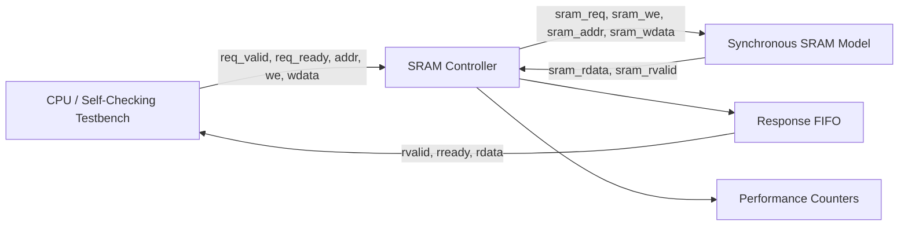

# Pipelined Burst SRAM Controller

> A synthesizable Verilog SRAM controller with valid/ready handshaking, burst transfers, response buffering, backpressure handling, performance monitoring, and a self-checking verification environment.


## Why this project matters

Memory controllers are not impressive because they can read and write a RAM once. They become useful when they continue behaving correctly under timing delays, burst traffic, and downstream backpressure. This project implements that control path and verifies it against a golden memory model.

## Key capabilities

- Valid/ready request interface for controlled acceptance of read and write commands
- `rvalid/rready` response interface for safe response consumption
- Burst read support
- Same-data burst write support
- Two-stage synchronous read path
- Response FIFO buffering to prevent response loss
- Backpressure handling when the consumer stalls
- Performance counter module for transaction monitoring
- Golden-memory, self-checking testbench
- Randomized stress tests and automatic data-mismatch detection

## Architecture



## Design specification

| Parameter | Value |
|---|---:|
| Data width | 16 bits |
| Address width | 10 bits |
| SRAM depth | 1024 locations |
| Read behavior | Synchronous, two-stage read latency |
| Request protocol | Valid/ready |
| Response protocol | `rvalid/rready` |
| Write mode | Single and same-data burst write |
| Read mode | Single and burst read |
| Verification simulator | Vivado XSim |

## Repository layout

```text
Pipelined-Burst-SRAM-Controller/
├── rtl/
│   ├── sram_controller.v        # Main controller RTL
│   ├── response_fifo.v          # Response buffering
│   ├── perf_counter.v           # Performance counters
│   └── sram_model.v             # Synchronous SRAM model
├── tb/
│   └── tb_sram_controller.v     # Self-checking testbench
├── docs/
│   ├── RESULTS.md               # Verification summary
│   └── images/                  # Waveforms and TCL-console screenshots
├── .gitignore
└── README.md
```

> Keep your original module names if they differ. Rename the files only when the module declarations and testbench instantiations are updated together.

## Verification strategy

The testbench maintains an independent golden-memory model and compares every read response returned by the DUT. It exercises the controller with directed and randomized traffic while checking interface behavior and unknown values.

### Test scenarios

1. **Multi-write followed by readback** — verifies basic data integrity.
2. **Back-to-back transactions** — verifies request sequencing without idle cycles.
3. **Burst reads** — verifies response order, burst termination, and read-data alignment.
4. **Same-data burst writes** — verifies multiple locations are updated correctly.
5. **Response backpressure** — holds `rready` low to verify that no response is lost or duplicated.
6. **Randomized stress test** — mixes reads, writes, bursts, and stalls.
7. **Protocol and X-value checks** — catches invalid handshakes and unknown read data.

## Engineering issues debugged

During implementation and verification, the following issues were identified and resolved:

- X-propagation on read data
- Incorrect `rvalid` and `rdata` alignment
- Duplicated read responses
- Burst termination errors
- Response loss under backpressure

These are exactly the kinds of bugs that separate a simple classroom RAM interface from a controller that has been genuinely verified.

## Results

The final self-checking environment completed directed and randomized tests with automatic mismatch detection enabled. Add your evidence below after uploading the images to `docs/images/`.

| Evidence | Add this file |
|---|---|
| Burst read waveform | `docs/images/burst_read_waveform.png` |
| Backpressure waveform | `docs/images/backpressure_waveform.png` |
| XSim/TCL pass log | `docs/images/xsim_pass_log.png` |
| Controller architecture | `docs/images/controller_architecture.png` |

## Running the project in Vivado XSim

1. Create or open a Vivado RTL project.
2. Add the design files from `rtl/` in dependency order.
3. Add `tb/tb_sram_controller.v` as a simulation source.
4. Set the testbench as the simulation top module.
5. Run behavioral simulation and inspect the pass messages and waveforms.

## What to inspect first

- The testbench's golden-memory comparison logic
- FIFO behavior while `rready` is low
- Alignment of `rvalid` with `rdata`
- Burst address progression and final-beat handling

## Author

**Amoghvarsh V. Bhasme**  
B.E. Electronics and Communication Engineering | RTL Design and Verification

---

### Repository status

Completed RTL and verification milestone. The repository is maintained as a portfolio project and focuses on readable RTL, evidence-driven verification, and documented design decisions.
